# 便携数控可调开关电源-开发记录

## 电源

### 开关电源拓扑选择

> [电源拓扑选择 | TI.com.cn](https://www.ti.com.cn/zh-cn/video/series/power-topology-selection.html)

基本分类：

- 非隔离/隔离 (Non Isolated/Isolated)：输入和输出是否共地
- 正激/反激 (Forward/Flyback)：能量传输到输出时开关状态

其中，非隔离SMPS有：

- 降压：Buck
- 升压：Boost
- 升降压：
    - BuckBoost
    - 4SW BuckBoost
    - SEPIC (Single-Ended Primary-Inductor Converter)
    - Zeta
- 负压：
    - Inverting BuckBoost
    - Cuk

考虑到DC/DC无需使用隔离拓扑，需要升降压，输出功率较大，故选择四开关BuckBoost拓扑，考虑到四开关BuckBoost可以做双向，故选之。

### 电源参数

| 参数名           | 参数值        |
| ---------------- | ------------- |
| 拓扑             | 4SW BuckBoost |
| 输入输出电压范围 | 12V~          |

## 显示

### 屏幕

> 淘宝：
>
> [FFC/FPC连接器1.0/0.5MM抽屉翻盖式上下接插座4/6/8/10/12/30~40P-tmall.com天猫](https://detail.tmall.com/item.htm?id=626563665786&spm=a1z0d.6639537/tb2.1997196601.4.b3a574846tapTS)
>
> [2.8寸TFT LCD 240X320高清液晶显示屏彩色lcd ili934触摸ST7789-淘宝网 (taobao.com)](https://item.taobao.com/item.htm?id=610189235154&spm=a1z0d.6639537/tb2.1997196601.239.b3a574846tapTS)

#### FPC排线

FPC（Flexible Printed Circuit Board）柔性印刷电路板，用于连接LCD显示屏与PCB。

FPC通常有两种：

- 焊接式：直接焊接到PCB母板
- 插接式：PCB母板上有对应的座子

为了组装方便和节约成本（重复使用一块屏幕），我选择插接式FPC。

#### FPC插座

FPC插座的选择包括几个部分：

1. 间距选择：FPC座子有多种间距，常见的有0.5mm、1.0mm的座子，间距指引脚中间与相邻引脚中间的距离。

    间距确定后就可以计算FPC线宽，线宽计算公式为：
    $$
    线宽=(\text{P}数+1)\times间距
    $$
    比如10Pin，0.5mm间距的线宽是(10+1)*0.5=5.5mm

    

2. 样式选择：常见的样式有：

    - 翻盖下接：引脚触点向下
    - 抽拉上接：引脚触点向上
    - 抽拉下接：引脚触点向下
    - 前插后翻盖：引脚触点上下都可以接触

    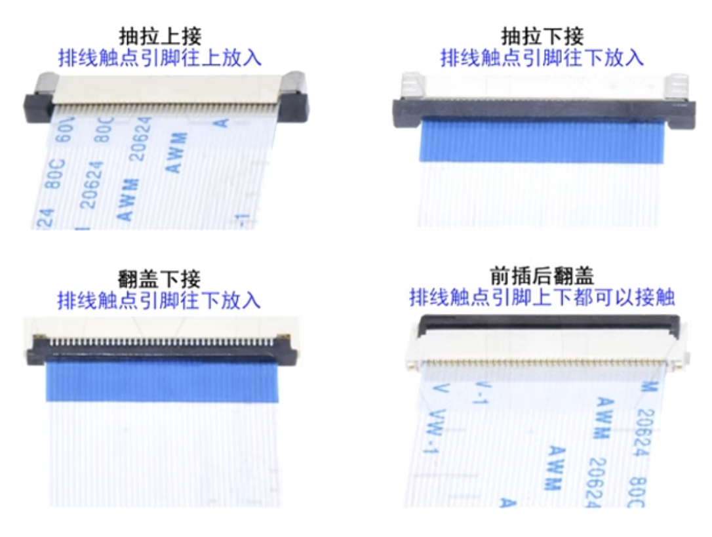

0.5mm间距的FPC插座封装图如下：

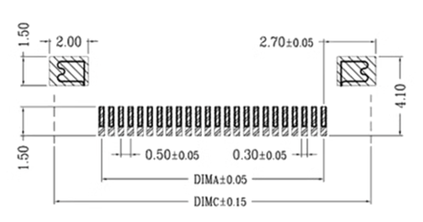

#### 串口or并口

串口LCD采用4线SPI接口

并口LCD采用MCU-LCD接口（Intel-8080接口），可以用STM32的FSMC外设驱动

因为STM32G474RET6引脚不够多，没有FSMC，故只能用串口屏

### 晶振

外部高速晶振：在能配出最高主频的情况下，外部晶振频率越高越好，原因是频率越高相位噪声越小。

故使用24MHz 3225无源晶振。

#### 负载电容

> [晶体（crystal、无源晶振）两端电容取值计算_晶体电容计算-CSDN博客](https://blog.csdn.net/Naisu_kun/article/details/86644845)

负载电容是指电路中跨接晶振两端的总的外界有效电容，晶振的数据手册一般给出负载电容

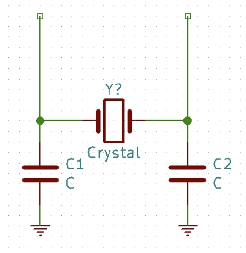

负载电容的计算公式：
$$
C_L=\frac{C_1C_2}{C_1+C_2}+C_S
$$
其中，$C_1$、$C_2$是晶振的匹配电容（如图），一般$C_1=C_2$；$C_S$是PCB的寄生电容，一般取3~5pF。

公式可以简化为：
$$
C_L=\frac{C_1}{2}+C_S
$$
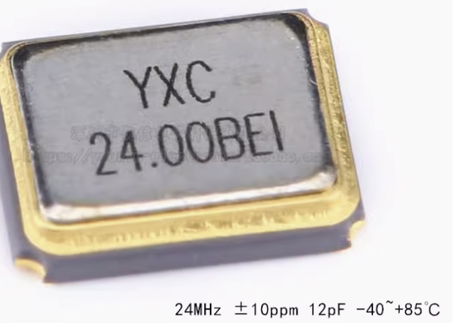

商品标的是12pF的负载电容，代入公式，取$C_S=3\sim5\text{pF}$，可得$C_1=14\sim18\text{pF}$，考虑贴片电容的误差，这里取15pF。

### BOOT

> [【经验分享】STM32G0系列的启动配置与程序下载 - STM32团队 ST意法半导体中文论坛 (stmicroelectronics.cn)](https://shequ.stmicroelectronics.cn/thread-631484-1-1.html)
>
> [【经验分享】STM32G0和STM32G4 如何把BOOT0当作通用GPIO使用 - STM32团队 ST意法半导体中文论坛 (stmicroelectronics.cn)](https://shequ.stmicroelectronics.cn/thread-631814-1-1.html)

STM32G4系列单片机为了节约引脚，取消了BOOT1引脚，只保留了BOOT0引脚，同时可以通过操作nBOOT0、nBOOT1、nSWBOOT0寄存器软件设置启动模式，节约BOOT0引脚。

**有三种启动模式：**

- Main Flash memory：主闪存，运行用户程序从这里启动；
- System memory：系统存储区，DFU（Device Firmware Upgrade）模式从这里启动；
- Embedded SRAM1：嵌入式内存，一般不用这个模式，用于调试。

**模式配置：**

- 当BOOT_LOCK=1时，从Main Flash memory启动
- 根据nSWBOOT0选择BOOT0从引脚还是寄存器取值，如果为1，从BOOT0引脚，如果为0从nBOOT0寄存器；BOOT1只从nBOOT1寄存器取值

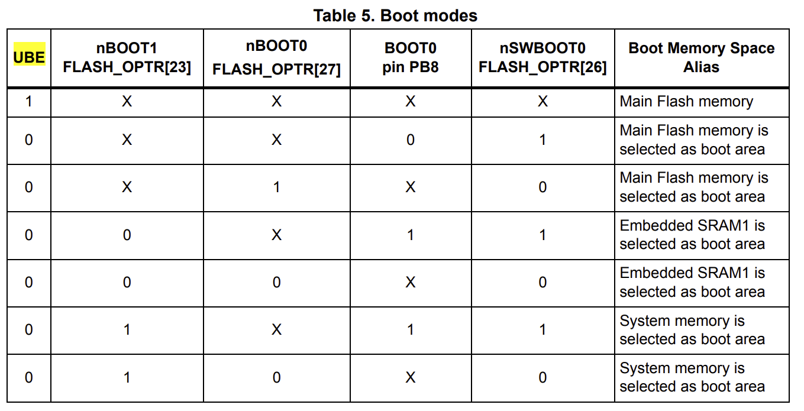

**默认的寄存器值：**

| 寄存器名  | 默认值 |
| --------- | ------ |
| BOOT_LOCK | 0      |
| nSWBOOT0  | 0      |
| nBOOT0    | 1      |
| nBOOT1    | 1      |

也就是说，默认会从Main Flash memory启动。

芯片出厂时会从System memory启动，烧录程序后从Main Flash memory启动，直到修改寄存器值。

**Option Bit的修改方式：**

- 通过HAL库软件修改

- 通过STM32CubeProgrammer修改，只能使用ST-Link

    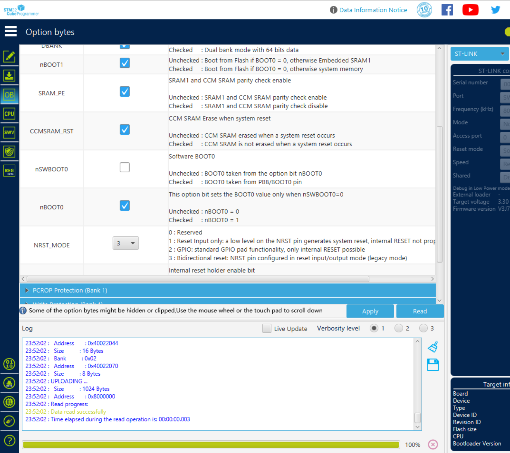

- 通过STLink Utility修改

#### 如果SWD接口被关闭了怎么办？

> **根据AN5093：**
>
> After reset (SYSRESETn or PORESETn), the pins used for the SWD are assigned as  dedicated pins which are immediately usable by the debugger host.
>
> RESET后，SWD接口会立即可用，直到SWD被软件关掉。
>
> [【经验分享】STM32G0系列的启动配置与程序下载 - STM32团队 ST意法半导体中文论坛 (stmicroelectronics.cn)](https://shequ.stmicroelectronics.cn/thread-631484-1-1.html)
>
> 如果更严重点，程序中把ST-LINK连接需要的 SWDIO 和 SWCLK 引脚用作它用了，ST-LINK也连接不上怎么办？解决方法也有，断开这两个引脚上别的电路连接，然后将芯片的 NRST 引脚保持下拉，这时候 STM32CubeProgrammer 上选择ST-LINK点击Connect，然后断开 NRST 的下拉，芯片会在启动的一瞬间被ST-LINK连接上。

### 板载ST-Link V2-1

> [自制ST-LINK V2-1（开源版本） - 嘉立创EDA开源硬件平台 (oshwhub.com)](https://oshwhub.com/CYIIOT/ST_LINK-V2_1)
>
> [Rebuild My own STLink V3.0 – 了起的博 (dalaotech.com)](https://dalaotech.com/2021/08/26/1107/)
>
> [[开源\]自制STLink V2.1 – 了起的博 (dalaotech.com)](https://dalaotech.com/2020/03/31/784/)

### UCPD

> [STM32StepByStep:Getting started with USB-Power Delivery Sink - stm32mcu (stmicroelectronics.cn)](https://wiki.stmicroelectronics.cn/stm32mcu/wiki/STM32StepByStep:Getting_started_with_USB-Power_Delivery_Sink)

两种方案：

1. VBUS供电Sink

    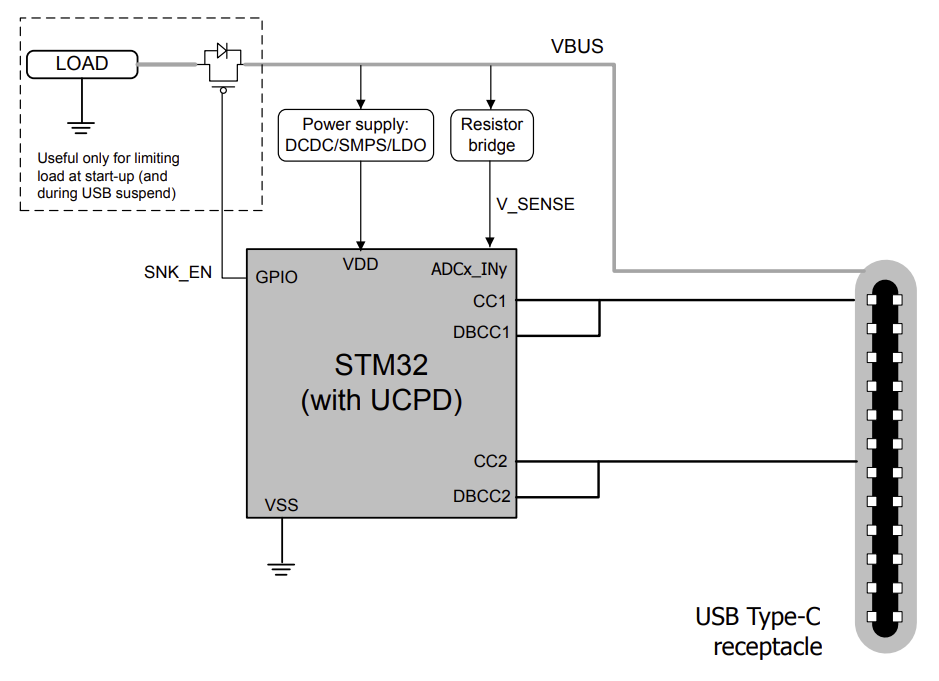

2. 分别供电Sink

    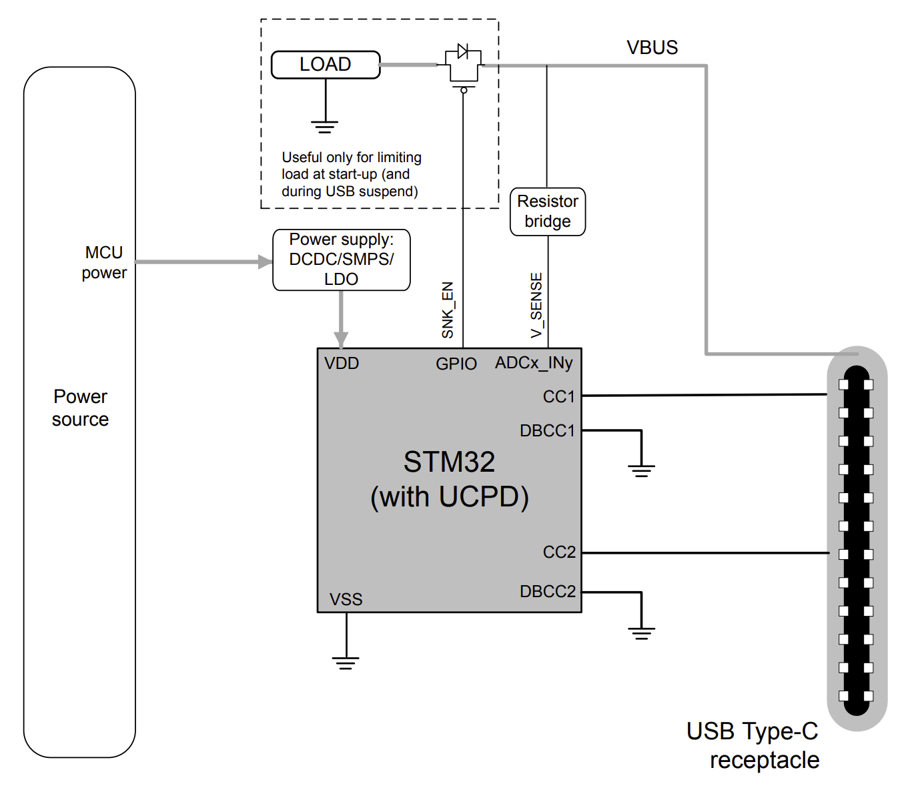

#### Dead Battery Support

### USB差分线

> [如何进行差分对走线（以KiCad中对USB布线为例）-电子工程专辑 (eet-china.com)](https://www.eet-china.com/mp/a69268.html)
>
> [PCB layout之USB差分走线布线经验教训 - 百度文库 (baidu.com)](https://wenku.baidu.com/view/c25a656a182e453610661ed9ad51f01dc2815794.html?_wkts_=1715932724428)

USB差分线参数：

- 差分阻抗90Ω±15%
- 每条线单端阻抗45Ω±15%
- 数据线总长度差不大于0.150英寸（3.81mm）
- 差分线尽可能在完整地平面上布线
- 避免90°直角
- 避免出现天线

USB差分线阻抗是90Ω，使用嘉立创阻抗计算：

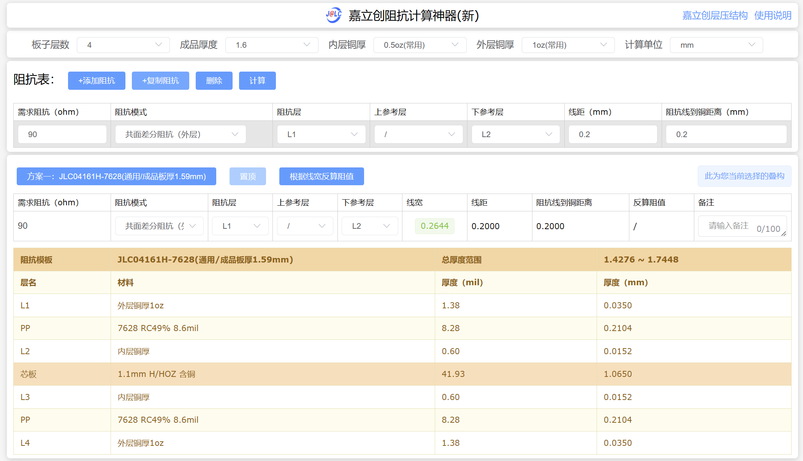

计算结果：

- 线距0.2mm
- 线到铜距0.2mm
- 线宽0.2644mm

差分线布线要点：

- 差分线优先布线，尽量缩短差分线走线距离

    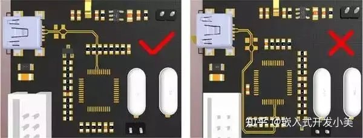

- 优先绘制差分线，尽量不要超过两对过孔，且需要对称放置

    

- 对称平行走线，避免90°走线，采用45°或弧形走线

    

- 差分串接电容、测试点、上下拉电阻的摆放方式

    

- 差分线等长

    

- 其他信号线距离至少20mil或遵循3W原则

    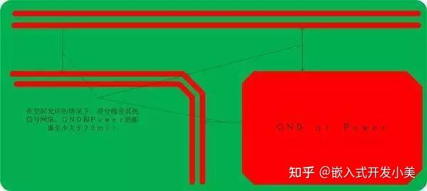

### GUI

> LVGL移植：
>
> [【快速入门 LVGL】-- 1、STM32 工程移植 LVGL_stm32 移值lvgl-CSDN博客](https://blog.csdn.net/qq_49053936/article/details/136696700)
>
> LVGL中文手册：
>
> [欢迎阅读LVGL(v9.0)中文开发手册！ — LVGL 文档 (100ask.net)](https://lvgl.100ask.net/master/index.html)
>
> LVGL手册：
>
> [Introduction — LVGL documentation](https://docs.lvgl.io/master/intro/index.html)
>
> LVGL V8.3 Examples:
>
> [Examples — LVGL documentation](https://docs.lvgl.io/8.3/examples.html)

#### 堆&栈

> [STM32 堆栈详解-CSDN博客](https://blog.csdn.net/eillwill/article/details/109185845)
>
> [STM32 内存分配解析及变量的存储位置 - wenzid - 博客园 (cnblogs.com)](https://www.cnblogs.com/wenziw5/p/12801667.html)

MDK-ARM编译后提示信息中，Size部分提示的含义：

- Code：代码，存在Flash
- RO-data(Read Only)：只读数据，例如常量，存在Flash
- RW-data(Read Write)：可读可写数据，例如已初始化的变量，存在Flash，运行时在RAM
- ZI-data(Zero Initialize)：没有初始化的变量，编译器初始化为0，运行时存在RAM

Total ROM Size = Code + RO-data + RW-data

Total RAM Size = RW-data + ZI-data

MCU上电时会先将RW-data从ROM中搬到RAM中，然后将ZI-data的RAM区域全部清零

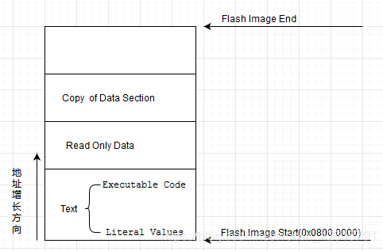

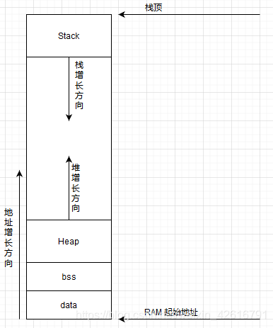

堆和栈都是存在RAM里的

- 栈（Stack）：由系统自动分配释放，存放局部变量和函数参数、返回地址
- 堆（Heap）：由程序员手动管理（malloc和free）
- bss段（Block Started by Symbol）：用来存放未初始化的全局变量和静态变量
- data段：存放已初始化全局变量和静态变量
- text段：存放可执行代码和只读常量（如字符串常量）

#### Debug单步调试前后乱跳

> [CubeIDE及Keil单步执行时来回乱跳的解决办法_keil的debug往回跳-CSDN博客](https://blog.csdn.net/wangpeng421/article/details/105970946)

原因：编译器优化，导致与C语句对应不上

解决方案：将优化调为Level 0 (-O 0)

#### LVGL不刷新，只显示颜色块

原因：`disp_flush()`编写错误，驱动提供的`ST7789_Fill()`只能填单色

解决方案：改用可以填多色的`ST7789_DrawImage`，但是会导致颜色不对，需要开启`LV_COLOR_16_SWAP`

### ST7789

#### 时钟极性和时钟相位

> [SPI中的CPHA,CPOL详解_spi cpha-CSDN博客](https://blog.csdn.net/win2000_li/article/details/100053217)

- CPOL(Clock Polarity, 时钟极性)
- CPHA(Clock Phase, 时钟相位)

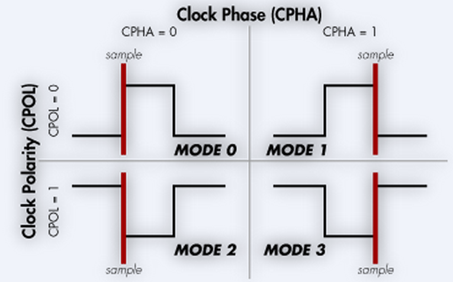

### GT911

> [STM32系列-CubeIDE、CubeMX配置GT系列GT911触摸芯片教程（图文快速上手）_stm32cube+gt911-CSDN博客](https://blog.csdn.net/m0_62287330/article/details/136950346)

中景园的显示屏已经配置好，无需写入配置表，只需要在启动前做好复位即可。